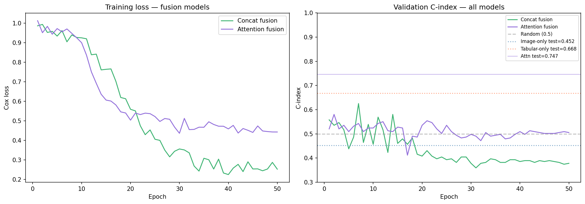
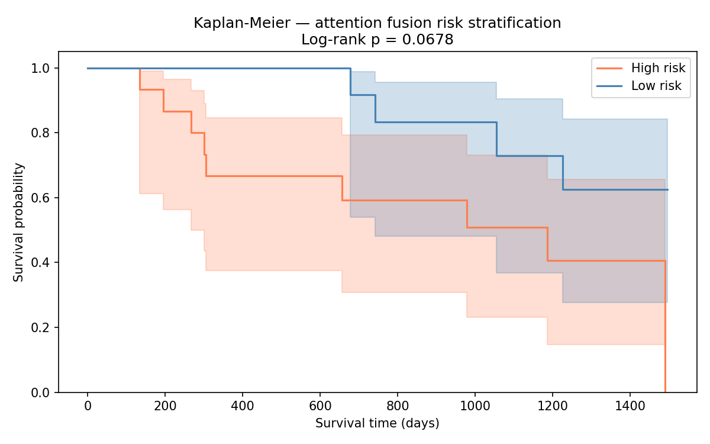
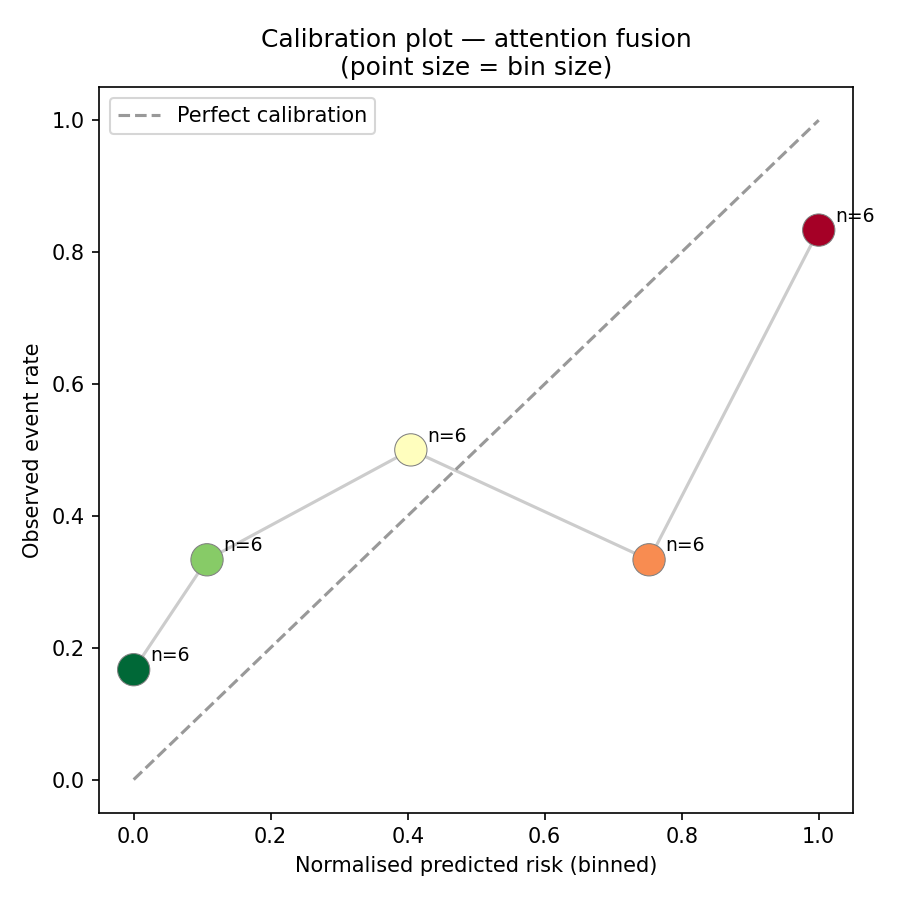
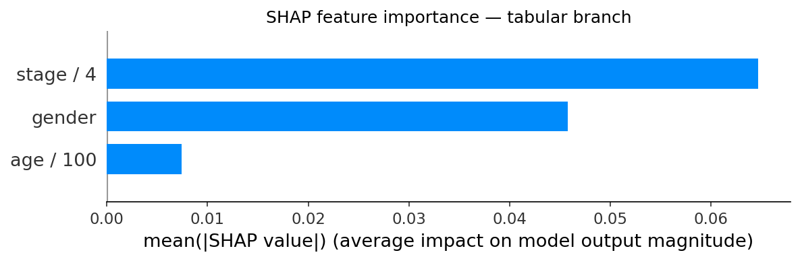

# Multimodal Cancer Prognosis via Cross-Modal Attention Fusion

> **Bidirectional cross-modal attention fusion of 3D CT imaging and clinical tabular data for NSCLC survival prediction.**  

[](https://www.python.org/)
[](https://pytorch.org/)
[](https://colab.research.google.com/)
[](LICENSE)

---

## Overview

This project implements and evaluates four survival prediction architectures on 200 NSCLC patients from the [TCIA NSCLC-Radiomics](https://www.cancerimagingarchive.net/collection/nsclc-radiomics/) collection:

| Model | Test C-index | vs. tabular-only |
|---|---|---|
| Image-only (3D ResNet) | 0.452 | −0.216 |
| Tabular-only (MLP) | 0.668 | — |
| Concat fusion | 0.697 | +0.029 |
| **Attention fusion (ours)** | **0.747** | **+0.079** |

The key finding is that **bidirectional cross-modal attention** outperforms naive concatenation by learning which clinical variables are most relevant *given* the observed CT content — and vice versa — on a per-patient basis.

---

## Architecture

```
CT volume (64³)          Clinical features (age, stage, sex)
     │                              │
┌────▼────────┐            ┌────────▼────┐
│ 3D ResNet   │            │  MLP (3→64) │
│ encoder     │            │  encoder    │
└────┬────────┘            └────────┬────┘
     │  f_i ∈ R^64         f_t ∈ R^64 │
     │                               │
     │     ┌─────────────────────┐   │
     │     │  Cross-modal        │   │
     └────►│  attention (↔)      │◄──┘
           │  f1 = attn(f_i→f_t) │
           │  f2 = attn(f_t→f_i) │
           └──────────┬──────────┘
                      │  [f1; f2] ∈ R^128
                 ┌────▼────┐
                 │  Cox PH │
                 │  head   │
                 └────┬────┘
                      │
               Risk score r ∈ R
```


## Quickstart

### Option A — Google Colab (recommended)

Open the notebooks in order. Each notebook installs its own dependencies.

1. [01 — Data pipeline](notebooks/01_data_pipeline.ipynb)
2. [02 — Baselines](notebooks/02_baselines.ipynb)
3. [03 — Fusion models](notebooks/03_fusion.ipynb)
4. [04 — Analysis](notebooks/04_analysis.ipynb)

### Option B — Local installation

```bash
git clone https://github.com/ranakinabadi/multimodal-cancer-prognosis.git
cd multimodal-cancer-prognosis

conda env create -f environment.yml
conda activate multimodal-prognosis

# Download 200 patients from TCIA
python scripts/download_data.py --n_patients 200 --output data/raw_ct/

# Preprocess to tensors
python -c "from src.data.preprocessing import preprocess_all; preprocess_all('data/raw_ct/', 'data/tensors/')"
```

---

## Results

### Ablation table

Training curves and test C-index for all four architectures:



### Kaplan-Meier survival stratification

Model-predicted high/low risk groups show trend toward statistical separation (log-rank p = 0.068, n=30 test patients):



### Calibration

Monotone relationship between predicted risk bins and observed event rate:



### SHAP feature attribution

Cancer stage is the dominant clinical predictor, consistent with established NSCLC prognosis literature:



---

## Limitations and future work

This is a proof-of-concept. Survival labels are **synthetic** (not derived from CT content), which explains the poor image-only C-index. The architectural design and ablation methodology are the primary contributions and remain valid under synthetic labels.

Planned extensions:
- Replace synthetic labels with real follow-up data from NSCLC-Radiomics-Lung1
- Add MC Dropout for calibrated survival uncertainty intervals
- Extend tabular branch with radiomics features from tumour segmentation masks
- Multi-site generalisation via optimal transport domain adaptation
- Topological loss terms for tumour segmentation 

---

---

## Acknowledgements

Data from [The Cancer Imaging Archive (TCIA)](https://www.cancerimagingarchive.net/).  

---

## License

MIT License — see [LICENSE](LICENSE).
